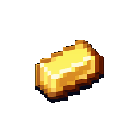

## GoldenForge

### What is GoldenForge ?

Goldenforge is an unofficial fork of [Forge](https://github.com/minecraftforge/minecraftforge) designed to improve performance of large-scale modded servers by implementing [Paper](https://github.com/PaperMC/Paper) performance patches.

### Is it stable ?

Goldenforge is currently in an alpha stage. Expect stuff to break. It's not ready for production. Please do not report issues to mod authors or forge.
  
  Nightly builds can be found [here](https://github.com/GoldenForge/GoldenForge/actions)

### Optimizations mods

Using optimizations mods with goldenforge can result in undefined behaviour.

Recommended mods :
- canary (require custom config [here](https://github.com/GoldenForge/GoldenForge/tree/1.19.2/docs/configs/canary.properties))
- goldenforge-fixes [Modrinth](https://modrinth.com/mod/goldenforge-fixes) | [Github](https://github.com/GoldenForge/GoldenForge-Fixes)

Incompatible mods :
- modernfix
- canary
- servercore (activation range and dynamic mobcaps already implemented)
- starlight (already implemented)
- pluto
- smoothchunks
- chunksending
- BiomeMakeover (see https://github.com/GoldenForge/GoldenForge/issues/17)
- randomTP (see https://github.com/GoldenForge/GoldenForge/issues/16)
- blueprint and mods that depend on it (i'm working on a fix)
