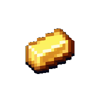

## GoldenForge

### What is GoldenForge ?

²Goldenforge is an unofficial fork of [NeoForge](https://github.com/neoforged/NeoForge) designed to improve performance of large-scale modded servers by implementing [Paper](https://github.com/PaperMC/Paper) performance patches.

| Version           | Support  | Download                                                                                   |
|-------------------|----------|--------------------------------------------------------------------------------------------|
| 1.21.1 (NeoForge) | Active   | [Github Actions](https://github.com/GoldenForge/GoldenForge/actions?query=branch%3A1.21.1) |
| 1.19.2 (Forge)    | Bugfixes | [Github Actions](https://github.com/GoldenForge/GoldenForge/actions?query=branch%3A1.19.2) |

### Is it stable ?

Goldenforge is currently in an alpha stage. Expect stuff to break. It's not ready for production. Please do not report issues to mod authors or forge.

Nightly builds can be found [here](https://github.com/GoldenForge/GoldenForge/actions)

### Optimizations mods

Using optimizations mods with goldenforge can result in undefined behaviour.

Recommended mods :
- ~~goldenforge-fixes [Modrinth](https://modrinth.com/mod/goldenforge-fixes) | [Github](https://github.com/GoldenForge/GoldenForge-Fixes)~~ no longer needed, built-in goldenforge itself

Incompatible mods :
- modernfix
- canary
- servercore (activation range and dynamic mobcaps already implemented)
- starlight (already implemented)
- pluto
- smoothchunks
- chunksending
- BiomeMakeover (see https://github.com/GoldenForge/GoldenForge/issues/17)
- randomTP (see https://github.com/GoldenForge/GoldenForge/issues/16)